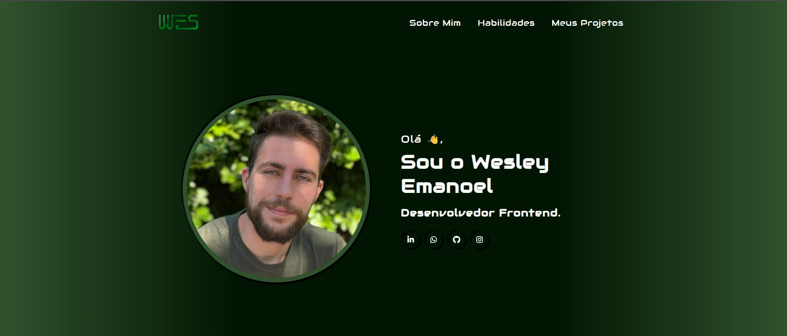

# Meu Portfólio / My Portfolio

Bem-vindo(a) ao meu portfólio! Este projeto foi desenvolvido como parte do meu aprendizado em desenvolvimento web, utilizando apenas **HTML** e **CSS**.

Welcome to my portfolio! This project was developed as part of my learning journey in web development, using only **HTML** and **CSS**.

## 📸 Tela inicial / Home screen

## 🔗 Links

- [Curso DevQuest](https://www.linkedin.com/school/devquest-dev-em-dobro/about/)
- [Meu LinkedIn / My LinkedIn](https://www.linkedin.com/in/wesley-emanoel-814a19352/)

## 🧠 Seções / Sections

- **Header** – Navegação principal do site / Main navigation
- **Home** – Introdução / Introduction 
- **Sobre mim / About me** – Informações pessoais e trajetória / Personal background and journey
- **Habilidades / Skills** – Tecnologias que domino / Tools & Technologies I use
- **Projetos / Projects** – Alguns dos meus trabalhos / Some of my work
- **Footer** – Contatos e redes sociais / Contact and social media

## 💡 Objetivo / Goal

Criar uma presença online profissional e prática, demonstrando minhas habilidades com HTML e CSS.  
To create a professional and practical online presence, showcasing my HTML and CSS skills.

## 🚧 Status

✅ Projeto finalizado, mas sujeito a melhorias futuras.  
✅ Project complete, but open to future improvements.

---

